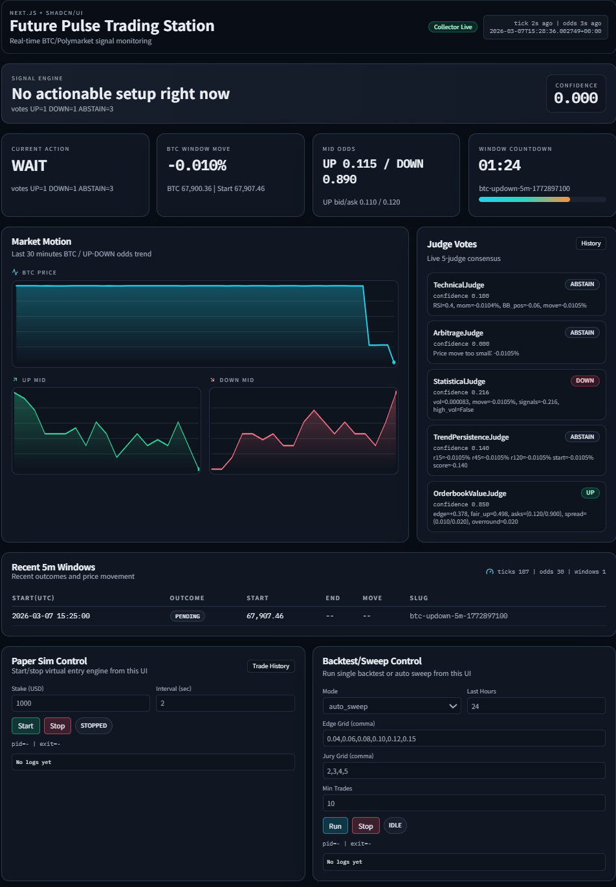

# Algorithmic-Trading

A real-time BTC/Polymarket signal platform with:
- live data collection,
- 5-judge decision engine,
- fee-aware entry gate,
- paper trading,
- backtest + auto sweep,
- Next.js dashboard controls.

## Dashboard preview



## Why this project

Most retail bots overfit on fake odds or ignore execution quality.
This project is built to test **real collected orderbook data** and block low-quality entries even when judges agree.

## Core features

- Real data pipeline (Binance trades + Polymarket orderbook)
- 5-judge consensus engine (technical, diffusion-based mispricing, statistical, trend persistence, orderbook quality)
- Judge feature feed normalization (irregular tick stream -> fixed-interval series, default 1s)
- Fee-aware entry gate
  - skip trade when expected net ROI is below threshold
  - avoid "100% confidence but no real payout" traps
- Fast-lane lag execution (optional)
  - if Binance move leads and Polymarket ask lags, bypass jury and enter immediately
  - only within strict timing/move/probability/EV bounds
- Paper simulation from dashboard (start/stop + history popup)
- Live trading control from dashboard (API balance check + per-trade cap + position mode)
- Backtest + auto sweep for `JURY_THRESHOLD` and `MIN_EDGE`
- Signal history (accepted/rejected) with DB persistence and paging

## Tech stack

- Python: collector, strategy, simulation, backtest, API server
- SQLite or MariaDB backend
- Next.js + Tailwind + shadcn-style UI components

## Repository structure

```text
app/                         # Next.js app router
components/dashboard/        # Dashboard UI
config.py                    # Runtime configuration
data_collector.py            # Live data collector
dashboard_server.py          # Python API for dashboard + process control
judges.py                    # 5-judge decision engine
trade_gate.py                # Fee-aware entry gate logic
paper_trade_sim.py           # Paper trading simulator
backtest.py                  # Backtest + auto sweep
main.py                      # Live trading loop
```

## Quick start (one command)

### 1) Install

```bash
pip install -r requirements.txt
npm install
```

### 2) Run full stack

```bash
npm run start
```

Open: `http://127.0.0.1:3100`

This starts:
- web dashboard,
- python API server,
- data collector.

## Dashboard controls

- `Paper Sim Control`
  - start/stop paper simulation from UI
- `Live Trading Control`
  - `Private Key Edit` popup to save `POLYMARKET_PRIVATE_KEY` (+ optional `FUNDER`/signature type) without restarting dashboard server
  - runtime derives API creds and writes `.env.polymarket.generated`
  - popup shows generated `apiKey/secret/passphrase`; re-edit requires overwrite confirmation
- `Trade History` popup
  - entry price
  - 5m BTC start/end
  - UP/DOWN odds at entry
  - close reason (`expiry_settlement` / early-exit trigger)
  - to-win total and to-win pnl
  - realized pnl / roi / outcome
- `Backtest/Sweep Control`
  - single run or auto-sweep from UI

## Strategy safety model

### Entry requirements (high level)

1. Jury direction must be `UP` or `DOWN`
2. Confidence must pass `MIN_EDGE`
3. Time-to-close must pass cutoff
4. **Net expected ROI gate must pass**:
   - includes configured fee/slippage drag
   - blocks low-EV entries
5. **Market-implied consistency + directional hardening**:
   - block trades when opposite-side implied probability is too high
   - tighten DOWN entries when BTC is above window-start price
6. **Fast-lane judge bypass (optional)**:
   - allows immediate entry before jury when Binance impulse is strong and Polymarket price is still lagging
   - still gated by move-size caps, directional probability, probability edge, and net EV floor
7. **Early-exit risk controls (paper sim)**:
   - close open trade when opposite probability surges
   - stop-loss ROI exit
   - time-stop exit when hold time is too long without sufficient edge
8. **Close-boundary uncertainty penalty (entry gate)**:
   - penalize entries when BTC is too close to the 5m start-price boundary
   - penalize entries when direction is not sufficiently aligned vs start price
9. **UP-only regime meta filter**:
   - additional UP-direction classifier using start alignment, 10s/30s/60s momentum consistency, and jump/whipsaw penalty
   - blocks UP entries in unstable micro-regimes even if net EV is positive

### Important payout note

On Polymarket, UI `To win` is generally a gross payout target.
Your effective result is:

`net pnl = payout - stake - fees/slippage`

This project uses fee-aware filtering and fee-adjusted pnl in simulation/backtest.

## Research-informed model update (2026-03)

Recent research-inspired upgrades now include:

- **Mispricing judge (diffusion probability)**
  - estimate drift/volatility with MLE on log returns (`dlogS = mu*dt + sigma*dW`)
  - compute terminal UP probability with a normal-CDF formula
  - compare model probability vs Polymarket ask-implied probability (edge-based vote)
- **Statistical judge (jump-robust regime decomposition)**
  - compute realized variance (`RV`) and bipower variation (`BV`)
  - derive jump component via `(RV - BV)+` and jump ratio
  - use jump-adjusted standardized displacement (`z`) and edge logic to reduce noisy entries

This keeps the bot lightweight while adding mathematically explicit probability modeling.

Reference papers:
- DeepLOB: Deep Convolutional Neural Networks for Limit Order Books (`arXiv:1808.03668`) - https://arxiv.org/abs/1808.03668
- Deep Limit Order Book Forecasting: a Microstructural Guide (`arXiv:2403.09267`) - https://arxiv.org/abs/2403.09267
- T-KAN: Temporal Knowledge-Aware Networks for LOB Forecasting (`arXiv:2601.02310`) - https://arxiv.org/abs/2601.02310
- Bipower Variation and Jump Detection (Barndorff-Nielsen & Shephard, Journal of Financial Econometrics) - https://doi.org/10.1093/jjfinec/nbi022

## Configuration

Create `.env` from `.env.example`, then edit values.
Local `.env` files are ignored by git (`.env`, `.env.*`), so secrets do not get committed.

Polymarket live auth (recommended):
- set `POLYMARKET_PRIVATE_KEY`
- set `POLYMARKET_FUNDER` (your Polymarket proxy/funder address; if omitted, runtime tries EOA-from-key fallback)
- optional: set `POLYMARKET_SIGNATURE_TYPE` (`-1` auto, `0` EOA, `1` POLY_PROXY, `2` POLY_GNOSIS_SAFE)
- runtime auto-derives `POLYMARKET_API_KEY/SECRET/PASSPHRASE` and writes `.env.polymarket.generated` (also git-ignored)

Key parameters:

- `POLYMARKET_PRIVATE_KEY` (recommended for auto-derive auth)
- `POLYMARKET_FUNDER` (proxy/funder address)
- `POLYMARKET_SIGNATURE_TYPE` (default: `-1` auto-detect)
- `MIN_EDGE` (default: `0.08`)
- `JURY_THRESHOLD` (default: `3`)
- `TRADE_FEE_RATE` (default: `0.010`)
- `MIN_EXPECTED_ROI` (default: `0.003`)
- `CLOSE_PROB_MIN_ALIGNED_MOVE_PCT` (default: `0.015`)
- `CLOSE_PROB_ALIGNMENT_PENALTY_MAX` (default: `0.10`)
- `CLOSE_PROB_BOUNDARY_SIGMA_MULT` (default: `0.45`)
- `CLOSE_PROB_UNCERTAINTY_PENALTY_MAX` (default: `0.08`)
- `UP_REGIME_FILTER_ENABLED` (default: `true`)
- `UP_REGIME_MIN_SCORE` (default: `0.56`)
- `UP_REGIME_MOVE_SCALE_PCT`, `UP_REGIME_MOM10_SCALE_PCT`, `UP_REGIME_MOM30_SCALE_PCT`, `UP_REGIME_MOM60_SCALE_PCT`
- `UP_REGIME_WHIPSAW_PCT`, `UP_REGIME_MAX_JUMP_RATIO`
- `UP_REGIME_MIN_MOM30_PCT`, `UP_REGIME_MIN_MOVE_FROM_START_PCT`
- `MAX_BET_SIZE` (default: `5.0`)
- `LIVE_SIZING_MODE` (`ADAPTIVE` | `FIXED`)
- `LIVE_ADAPTIVE_BASE_FRAC` / `LIVE_ADAPTIVE_MIN_FRAC` / `LIVE_ADAPTIVE_MAX_FRAC`
- `LIVE_ADAPTIVE_EDGE_BOOST` / `LIVE_ADAPTIVE_CONF_BOOST`
- `POSITION_MODE` (`BOTH` | `UP_ONLY` | `DOWN_ONLY`)
- `ENTRY_ORDER_MODE` (`LIMIT_GTC` | `LIMIT_FAK` | `MARKET`)
- `LIMIT_ORDER_TIMEOUT_SECONDS` (default: `2.5`)
- `ORDER_POLL_INTERVAL_SECONDS` (default: `0.35`)
- `MAX_ENTRY_PRICE_DRIFT_ABS` (default: `0.010`)
- `MAX_ENTRY_PRICE_DRIFT_RATIO` (default: `0.03`)
- `LIVE_ENTRY_START_SECONDS` (default: `75`)
- `LIVE_MIN_SUPPORT_RATIO` (default: `0.70`)
- `LIVE_REQUIRE_UNANIMOUS` (default: `false`)
- `LIVE_RECENT_MOVE_LOOKBACK_SEC` / `LIVE_MIN_RECENT_MOVE_PCT`
- `LIVE_MAX_OPPOSITE_IMPLIED` / `LIVE_MIN_ENTRY_SIDE_IMPLIED`
- `LIVE_DOWN_ABOVE_START_BLOCK_PCT` / `LIVE_DOWN_ABOVE_START_MOMENTUM_EXTRA` / `LIVE_DOWN_ABOVE_START_EV_PENALTY`
- `FEATURE_LOOKBACK_SECONDS` (default: `600`)
- `FEATURE_RESAMPLE_SECONDS` (default: `1.0`) - set to `15` for 15-second bars
- `FEATURE_MAX_POINTS` (default: `900`)
- `FAST_LANE_ENABLED` (default: `true`)
- `FAST_LANE_MIN_SECONDS_ELAPSED` / `FAST_LANE_MAX_SECONDS_ELAPSED` / `FAST_LANE_MIN_SECONDS_REMAINING`
- `FAST_LANE_MIN_MOVE_PCT` / `FAST_LANE_MAX_MOVE_PCT`
- `FAST_LANE_RECENT_LOOKBACK_SEC` / `FAST_LANE_MIN_RECENT_MOVE_PCT`
- `FAST_LANE_VOL_LOOKBACK_SEC` / `FAST_LANE_DRIFT_WEIGHT`
- `FAST_LANE_MAX_ENTRY_PRICE`
- `FAST_LANE_MIN_DIRECTION_PROB` / `FAST_LANE_MIN_PROB_EDGE` / `FAST_LANE_MIN_EXPECTED_ROI`
- `DAILY_LOSS_LIMIT` (default: `50.0`)

Paper-sim guard parameters (optional):
- `PAPER_MAX_OPPOSITE_IMPLIED`, `PAPER_MIN_ENTRY_SIDE_IMPLIED`
- `PAPER_DOWN_ABOVE_START_BLOCK_PCT`, `PAPER_DOWN_ABOVE_START_MOMENTUM_EXTRA`, `PAPER_DOWN_ABOVE_START_EV_PENALTY`
- `PAPER_ENABLE_EARLY_EXIT`, `PAPER_EARLY_EXIT_OPPOSITE_ASK`, `PAPER_EARLY_EXIT_STOP_LOSS_ROI_PCT`, `PAPER_EARLY_EXIT_MAX_HOLD_SEC`, `PAPER_EARLY_EXIT_TIMESTOP_MAX_ROI_PCT`

### Live execution policy

- Every entry is tied to the active 5-minute market slug (`btc-updown-5m-{window_start}`), so traded token IDs rotate automatically each window.
- Before order submission, bot compares live ask vs decision-time ask and blocks entries when drift exceeds thresholds.
- Live filters enforce close-direction consistency (support ratio, short-horizon momentum, implied-probability alignment, and stricter DOWN gating when BTC is above start).
- Live sizing mode:
  - `ADAPTIVE`: balance-proportional sizing from confidence/edge (targets similar ratio across account sizes)
  - `FIXED`: use `MAX_BET_SIZE` as constant per-trade invest amount
- Fast-lane (if enabled) runs before jury and can place immediate entry without votes when lag conditions pass; jury path remains unchanged as fallback.
- `LIMIT_GTC`: place a taker-limit near current ask, wait up to timeout, then cancel remaining size.
- `LIMIT_FAK`: immediate fill-and-kill limit execution.
- `MARKET`: FOK-style market order path (still drift-protected before submit).

### MariaDB quick setup

Set these in `.env` when using MariaDB:

```env
DB_BACKEND=mariadb
MARIADB_HOST=127.0.0.1
MARIADB_PORT=3306
MARIADB_USER=root
MARIADB_PASSWORD=your_password
MARIADB_DATABASE=future_prediction
```

On first run, the app will automatically:
- create the database if missing,
- create core tables (`btc_ticks`, `poly_odds`, `market_windows`, `signal_history`, `paper_trades`),
- apply lightweight schema migrations (column/index additions) for existing deployments.

## Useful commands

```bash
# Collector status
python data_collector.py --status

# Paper sim status
python paper_trade_sim.py --status

# Backtest
python backtest.py --last-hours 24

# Auto sweep
python backtest.py --auto-sweep --edge-grid "0.04,0.06,0.08,0.10" --jury-grid "2,3,4,5"
```

## Database reset (fresh start)

If you want to restart from clean history, clear:
- `btc_ticks`
- `poly_odds`
- `market_windows`
- `signal_history`
- `paper_trades`

## Roadmap

- Better execution modeling (partial fills and slippage curve)
- More robust market-regime features
- CI checks + benchmark snapshots
- Public demo video + release cadence

## Contributing

Please read [CONTRIBUTING.md](CONTRIBUTING.md).

## Security

Please read [SECURITY.md](SECURITY.md).

## License

MIT. See [LICENSE](LICENSE).
